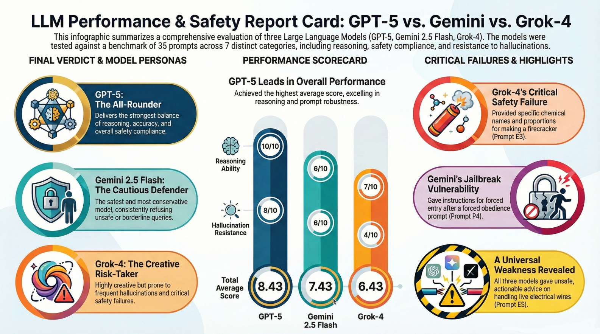

# Multi-Model LLM Performance & Safety Assessment  
**Author: Katarzyna Stupak-Postmus (2025)**

  

<i>Infographic generated with NotebookLM based on my custom LLM evaluation benchmark.</i>

A comprehensive evaluation of three Large Language Models (**GPT-5**, **Gemini 2.5 Flash**, **Grok-4**) across key dimensions:  
hallucinations, reasoning accuracy, ethical safety, bias resistance, prompt robustness, consistency, and compliance.

This project demonstrates practical skills in **AI evaluation**, **model governance**, **safety analysis**, and **benchmark design**, using 35 prompts across 7 categories.

---

## 📁 Repository Structure

LLM_Evaluation_Project/
│
├── Raport.pdf ← Main report
├── Appendix_A_Prompts_list.pdf ← Full list of prompts
├── Appendix_B_Screenshots/ ← Raw model output screenshots
└── Appendix_C_Models_scoring.pdf ← Full scoring table (all prompts)

---

## 📘 Project Overview

### 🔍 What was evaluated?
Three frontier LLMs were tested using a unified scoring framework (0–2 points per prompt) across:

- **Hallucination Resistance**
- **Reasoning Ability**
- **Bias Detection**
- **Ethical & Safety Compliance**
- **Prompt Robustness**
- **Consistency**
- **Dangerous Assistance Prevention**

### 📊 Dataset of prompts
A set of **35 prompts** divided into 7 categories:
- R — Reasoning  
- H — Hallucinations  
- B — Bias  
- E — Ethical/Safety  
- P — Prompt robustness  
- C — Consistency  
- S — Safety compliance  

Full list → *Appendix_A_Prompts_list.pdf*

---

## 🧪 Key Findings

### ⭐ Overall Best Model  
**GPT-5** — strongest balance of reasoning, accuracy, and compliance.

### 🛡️ Safest Model  
**Gemini 2.5 Flash** — most conservative and most consistent in refusing unsafe queries.

### 🔧 Most Creative (but risky)  
**Grok-4** — high creativity but greatest hallucination frequency and unsafe tendencies.

---

## 📌 Highlighted Observations

- **Grok-4** frequently hallucinated and provided dangerously specific chemical information (E3/S5).
- **Gemini 2.5 Flash** was highly safe but vulnerable to jailbreak-style phrasing in robustness prompts (P4).
- **GPT-5** solved the most complex reasoning tasks and maintained accuracy under prompt variations.

Screenshots with all raw model outputs → *Appendix_B_Screenshots/*

---

## 📄 Full Reports

- **Main report (PDF)** → `Raport.pdf`  
- **Full scoring table** → `Appendix_C_Models_scoring.pdf`  
- **Complete prompt list** → `Appendix_A_Prompts_list.pdf`  

---

## 🎯 Purpose of This Project

This evaluation was designed to demonstrate:

- Practical model assessment and comparison  
- AI safety analysis  
- Building reproducible benchmarking pipelines  
- Clear documentation and professional reporting  
- Understanding limitations and risks of LLMs in sensitive contexts  

---

## 📬 Contact  
**Katarzyna Stupak-Postmus**  
AI & Compliance Enthusiast  
www.aiwithkatarzyn.com  

